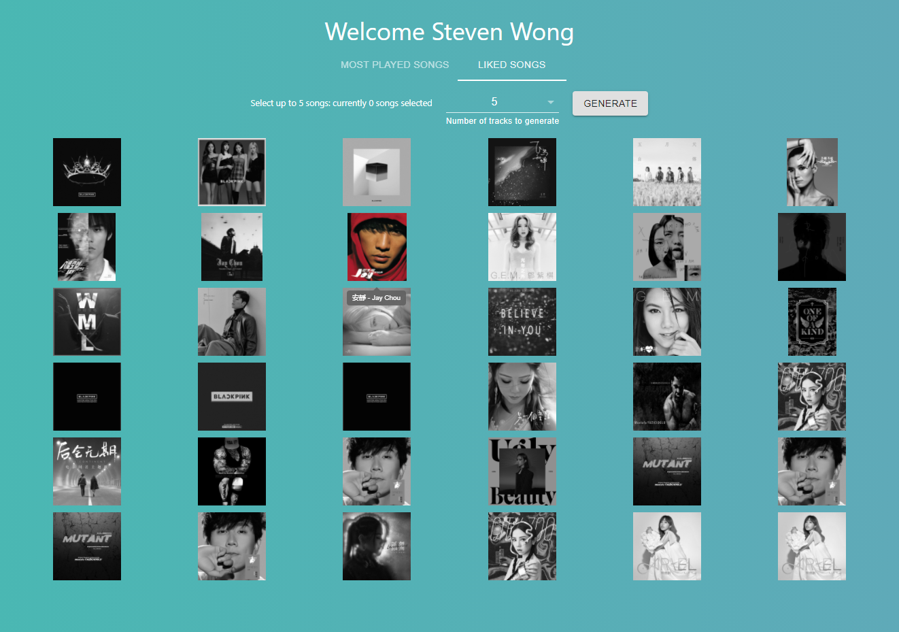
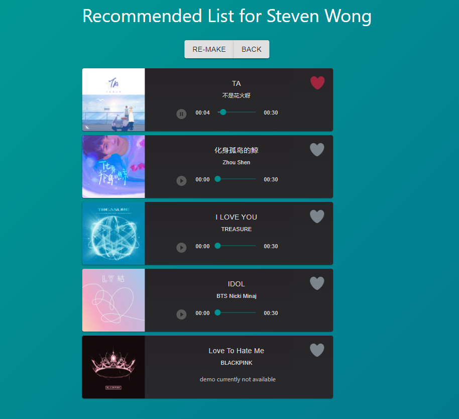

# music-discovery

Discover new songs at your finger tips ...

https://music-discovery-1965b.web.app/

## Contents

* [About the project](#about-the-project)
* [Contributors](#contributors)

### About the project

Upon visting the web application, the user will first be prompted to authenticate their spotify account login credentials. Once the user has successfully logged in, their spotify songs will be displayed on to the screen. The user can then select up to five songs from their list, which will be used as inputs, to algorithmically generate a brand new list of songs for the user to explore. User can also save songs directly from the generated list.

### Screenshots

<!--

-->

#### Technologies used:

- [Spotify Api](https://developer.spotify.com/documentation/web-api/)
- React
- Material UI
- Bootstrap 5
- JavaScript
- Node.js
- Express.js

### Contributors

Originally created by Steven Wong and Michelle Huang.

**Steven Wong** 
UBC Computer Science Student 
[https://twitter.com/swongggg](https://twitter.com/swongggg)

**Michelle Huang** 
UX Developer 
[https://github.com/michelle714](https://github.com/michelle714)
